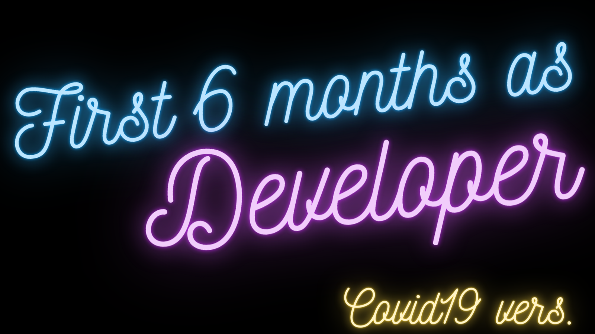

## Starting out as a FrontEnd Developer in Covid-19 Times

6 months have flown by since starting a new job as FrontEnd Software Developer and a year since deciding to self-study my way into the Software Development world.

When I started my first day of work in March, Covid-19 cases were surging worldwide. Eventually, what everyone expected to be a passing outbreak became a worlwide pandemic and I ended up going to office for less than a dozen times and working from home ever since.

<div style="width:80%;margin:auto;padding-bottom:50%;height:0;position:relative;"><iframe src="https://giphy.com/embed/chVgEkHr9oYz4ZPGeU" width="100%" height="100%"
style="position:absolute"
frameBorder="0" class="giphy-embed"></iframe></div><p style="font-size:0.75rem;text-align:center;"><i>please open back soon</i></p>
</br>

This essay is my attempt at reviewing the first half-year of working as a Junior Software Developer in the world hit by Covid-19. Just like a Retrospective in an <a target="_blank" href="https://www.atlassian.com/agile/scrum/sprints">Agile Sprint</a>, I've written down what went well (Like) & what could be improved (Dislike) and how I can do a better job going forward.

## 👍 Like - What went well

### First PR merge 🥳

Every Developer has a first Pull Request merge *(which means you contribute to the code repository)*. My journey to the first ever PR merge was not an easy one. Firstly, setting up the Dev Environment to start developing met with many obstacles as my work started remotely. Even though I had experience working remotely as Marketer in my previous job, working remotely as Developer was whole new thing. I had to get past the mental barrier of repeatedly asking for help over Slack to my colleagues whom I barely just met. So that took a painstakingly long period of time... 

<div style="width:80%;margin:auto;padding-bottom:50%;height:0;position:relative;"><iframe src="https://giphy.com/embed/hrRJ41JB2zlgZiYcCw" width="100%" height="100%" style="position:absolute" frameBorder="0" class="giphy-embed"></iframe></div><p style="font-size:0.75rem;text-align:center;"><i>basically me in my first month</i></p>

When I was finally assigned a task of building a Web UI component, subsequent challenges came. A lot of time was spent alone digesting and playing around with the existing code and trying to make sense of which code does what. Even though I knew coding would involve many lone battles, it certainly didn't help doing it while on WFH. 

Of course when I was too stuck to do anything, I saught help from senior Devs. This process of me just figuring things out continued for months and after countless Slack messages, Webex sessions and PR comments... TADA!


YES the excitement and sense of achievement when I got that Pull Request approval and my branch got merged into the main branch 😍. My first ever PR came like a sweet Oasis and I was so relieved that I could finally call myself a real "Software Developer" now.

### Learn & Learn Everyday

There are so many new things I learned in past 6 months at the rate I'd never imagined I could.

<div style="width:80%;margin:auto;padding-bottom:50%;height:0;position:relative;">
    <iframe src="https://giphy.com/embed/ZoAa7lsmym6UE" width="100%" height="100%" style="position:absolute" frameBorder="0" class="giphy-embed" ></iframe>
</div>
<p style="font-size:0.75rem;text-align:center;"><i>ok..</i></p>

Firstly about the product itself, <a href="https://www.ibm.com/sg-en/products/verify-for-workforce-iam" target="_blank">Identity and Access Management (IAM)</a> - not a product widely known to the public but it serves as important internal gateway for many enterprises, giving right access to right people in the organisation and preventing leakage of information.

More about software development aspect, I learnt following tech skills and concepts **and recorded here @ <a href="https://dohun.xyz/TIL" target="_blank">TIL</a>**

- FrontEnd Skills - Learnt a lot about using <a href="https://dohun.xyz/TIL/docs/react-prop-vs-state" target="_blank">React</a> & its different architectures to build Web UI. Also more used to <a href="https://dohun.xyz/TIL/docs/css-grid" target="_blank">CSS Grid</a> <a href="https://dohun.xyz/TIL/docs/css-flexbox" target="_blank">and Flexboxes</a>. Enlightened with <a href="https://dohun.xyz/TIL/docs/intro-to-ts" target="_blank">TypeScript</a> that supercharges <a href="https://dohun.xyz/TIL/docs/js-wth-is-es" target="_blank">Javascript</a>. (Now I appreciate the Type for its easy of debugging and clarity in the code 😉)
- DevOps - Learnt most essential Git commands for Software Devs *(So that I don't mess up the whole code base)* & raising PRs + working with the reviews to get the **MERGE**. Also learnt new End-to-End testing methodology called Cucumber using Java.

As a junior Software Developer, it can be scary when encountered with new concepts and information what I don't know. But I've learnt to enjoy the process of learning new concepts and applying them. Also it's one of the most valuable skill to acquire thesedays - learning & unlearning things fast. In the myriad of new software concepts rising and falling, Developers need to adapt to the most useful tool fast for timely applications. So I'm grateful that I'm on the right track to be learning fast.

### Surviving & Adapting to WFH

My experience of first 6 months working as a Software Developer was very unique because it was in the transition to the WFH as a "new norm". Singapore entered a complete lockdown in beginning April where people could not interact with others from different household. Only time people could be out was for purchasing essential groceries or exercising. This continued till end June with measures easing little by little.

While it may have been a setback for many, I adapted relatively well to the new WFH routines. I was already living a routine life while self-studying to become a Developer so I focused on maintaining good habits for mental health and physical health during lockdown.

My typical work day during lockdown was:

```markdown
9AM: Wake up, Make coffee ☕ & Meditate 🧘‍♂️

9.30AM - 6/7PM: Work (From Home) 👨‍💻

7PM: Run 5km 🏃‍♂️ or Home Training 💪

9PM - Sleep: Side Project or additional learning 📚
```

*(Of course weekends were spent eating good food and drinking with housemates watching our favourite shows ☺️)*

WFH actually gave me a lot of time for self-improvement, be it work or life. These new habits - Mediating and Exercising got me through difficult times like this where things are out of your control. Only thing I could control was how I perceived the situation and I learnt to do this through these new habits. As a Software Dev, I could commit time saved from commuting to working and learning. Building side project and taking additional Udemy courses would have been more difficult if I was travelling to work everyday.

<div style="width:80%;margin:auto;padding-bottom:50%;height:0;position:relative;">
<iframe src="https://giphy.com/embed/H7kfFDvD9HSYGRbvid" width="100%" height="100%" style="position:absolute" frameBorder="0" class="giphy-embed"></iframe></div>
<p style="font-size:0.75rem;text-align:center;"><i>keep calm and meditate</i></p>

Nobody knows how world will turn out post Covid-19 but these new habits - meditating, exercising and learning are here to stay in my life.

## 👎 Dislike - Can do better

### Lack of Communications & Interaction

One of the area I need improvement on is involvement in Dev community.

Since I started working as Software Developer, my expectation was to be actively involved in Dev community with fellow Developers in and out of my workplace to talk about what they build and how they build. Talking about new technology and methodologies of building a Software product.

However, Covid-19 was a physical hinderance to social interaction with fellow Developers at my workplace as well as Dev Community in Singapore. To someone like me who prefers Offline social interaction, it wasn't easy to get used to online gatherings. Meeting the people I've never met before on the screen was not very comfortable so I gradually interacted less. 

Ironically there were even more online Dev events available as events in other countries were held online but I couldn't get out of my comfort zone and missed out on opportunities to meet fellow Developers and learn more from them.

As I believe that being involved and contributing to the open community is one of the most important aspect of being a Software Dev, I do wish to get better on this - even if Covid-19 hangs around.

## Sapjil (삽질)

Sapjil is a Korean word for digging. I realised that it's a very relatable word to be used in software development - describing a Dev getting stuck on a bug or code problem and stubbornly struggling to get past the problem.

<div style="width:80%;margin:auto;padding-bottom:50%;height:0;position:relative;">
<iframe src="https://giphy.com/embed/4EF5LwiRfpBKQUOsoF" width="100%" height="100%" style="position:absolute" frameBorder="0" class="giphy-embed"></iframe>
</div>
<p style="font-size:0.75rem;text-align:center;"><i>dig and dig..</i></p>

When I got assigned to a task at work, I would nose-dive into the task without much plan not realising how deep the water was.. Eventually I would end up spending days stuck on a seemingly small and simple issue. Looking back, what I had to do was to test the water - check how deep it is, see if there is any dangerous reef hidden, estimate how long to dive (figuratively) - all such that I could swim back alive to the ship 🚢 on time & ride with the planned sprint timeline.

One of the common mistakes was not breaking the dev task into smaller parts. For example, building a UI screen which shows a table with filter panel & details panel. I tackled this task in non-sequential order taking too much time. By right, I should have tackled them logically by each components.

Most importantly, if I had *Sapjil* enough and can't seem to find the answer, I need to ask for help from fellow Devs. It will provide new perspective to solve the problem and shorten the development time significantly.

## Next & Coming soon,,,

So I've shared what I went well and not well in my first 6 months working as a Developer. 

If someone would ask, "So is this what you expected?", I'd say... HECK YEAH. I love what I do day to day as a Software Developer - building and shipping software product. Although WFH life was not what I expected, it turned out more positive than negative and it will be more important for me to make it better from now.

This review comes with a couple of reflections and areas of improvement where I'd like to see myself get better at. I listed down the types of articles to be posted on my blog in coming months:

- Singapore Dev Community meet up review
- How to improve as a Front End Software Developer
- How I built XXX as a side project using YYY
- 10 new tech skills I've learned
- On maintaining good habits

Hopefully I manage to write those articles while staying safe and well from Covid-19. Ending with a quote I love from the meditation app "Calm" on mind control in this tough times of worldwide pandemic.

